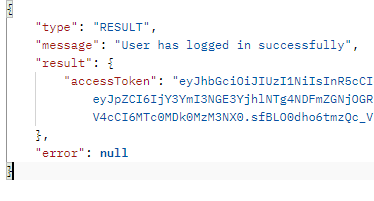

# Content Subscription API

## Overview

This is a RESTful API for a content subscription platform where users can register, subscribe to content categories, receive personalized recommendations, and get email notifications. The API also supports JWT-based authentication and third-party content integration.

## Live Demo

- **URL:** [https://content-subscription.onrender.com](https://content-subscription.onrender.com)

## Features

- **User Authentication**
  - Register a new user
  - Login and obtain JWT token
- **Subscription Management**
  - Subscribe to content categories
  - Receive email confirmation upon subscription
- **Content Personalization**
  - Fetch personalized content based on subscribed categories
  - Integration with external APIs for content curation
- **Email Notifications**
  - Subscription confirmation emails

## Tech Stack

- **Backend:** Node.js, Express.js
- **Database:** MongoDB (Mongoose ORM)
- **Authentication:** JWT (JSON Web Token)
- **Email Service:** Nodemailer (Gmail/SMTP)
- **External API Integration:** NewsAPI
- **Deployment:** Render

## API Testing Guidelines

### 1. Import the Postman Collection

- Import the Postman collection through the following path: `src/postman/postman-collection.json`.

### 2. Set Up Environment Variables

- Set the following environment variables in Postman:
  - `baseUrl` = `https://content-subscription.onrender.com/api`
  - `accessToken` (to be set after logging in, dynamically)

### 3. Test Authenticated Routes

- Use the **Bearer token** in the **authorization header** to test authenticated API routes.
  - Example:
    - `authorization: Bearer {{access_token}}`
- Expected: A valid token should return a `200 OK` response with the requested data.
- If the token is invalid or expired, you should receive a `401 Unauthorized` response.

## Recording Demo

### Authentication

#### Register a new user

`POST /api/p/auth/register`

```json
{
  "userName": "BeNew",
  "email": "sifat.cse.ewu@gmail.com",
  "password": "samplepassword"
}
```

Response:

```json
{
  "type": "RESULT",
  "message": "User has been created successfully",
  "result": {},
  "error": null
}
```

#### Login

`POST /api/p/auth/login`

```json
{
  "email": "sifat.cse.ewu@gmail.com",
  "password": "samplepassword"
}
```

Response:


### Subscription

#### Subscribe to categories

`GET /api/a/category`
**Headers:** `authorization: Bearer <token>`

Response:

```json
{
  "type": "RESULT",
  "message": "OK",
  "result": [
    { "_id": "67bac66ce97818ba1f8257e0", "name": "Health" },
    { "_id": "67bac66ce97818ba1f8257e4", "name": "Tech" },
    { "_id": "67bac66ce97818ba1f8257e8", "name": "Business" }
  ],
  "error": null
}
```

`POST /api/a/category/subscribe`
**Headers:** `authorization: Bearer <token>`

```json
{
  "categoryId": "67bac66ce97818ba1f8257e8"
}
```

Response:

```json
{
  "type": "RESULT",
  "message": "You have successfully subscribed to selected category, for confirmation check your email",
  "result": {},
  "error": null
}
```


### Fetch Personalized Content

`GET /api/a/feed`
**Headers:** `Authorization: Bearer <token>`

Response:

```json
{
  "type": "RESULT",
  "message": "OK",
  "result": {
    "totalCount": 95,
    "articles": [
      {
        "source": {
          "id": "financial-post",
          "name": "Financial Post"
        },
        "author": "Bloomberg News",
        "title": "Hochul Meets With Trump to Defend NYC Congestion Pricing",
        "description": "US President Donald Trump met on Friday with New York Governor Kathy Hochul, who defended New York City’s congestion pricing program two days after the US moved to undo the toll system.",
        "url": "https://financialpost.com/pmn/business-pmn/hochul-meets-with-trump-to-defend-nyc-congestion-pricing",
        "urlToImage": "https://smartcdn.gprod.postmedia.digital/financialpost/wp-content/uploads/2025/02/776260509.jpg",
        "publishedAt": "2025-02-22T19:41:19Z",
        "content": "US President Donald Trump met on Friday with New York Governor Kathy Hochul, who defended New York Citys congestion pricing program two days after the US moved to undo the toll system.\r\nAuthor of the… [+5076 chars]"
      }
    ]
  }
}
```

## Deployment

This API is deployed on **Render**. You can access the live API at:

- **[Live Link](https://content-subscription.onrender.com)**
